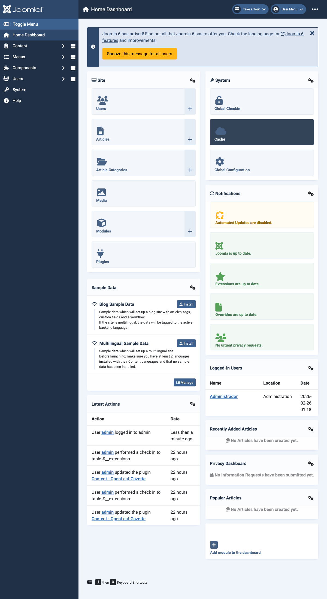
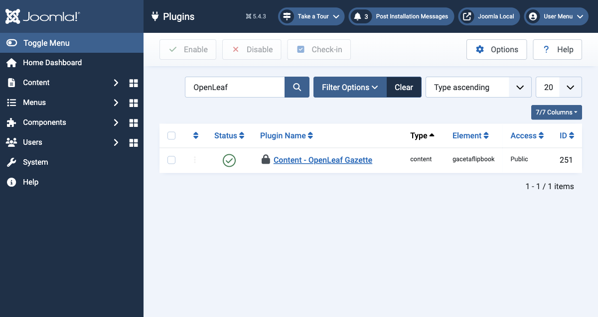
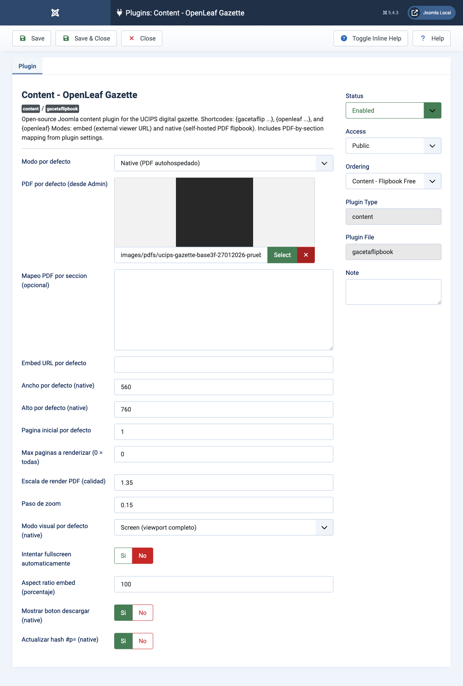
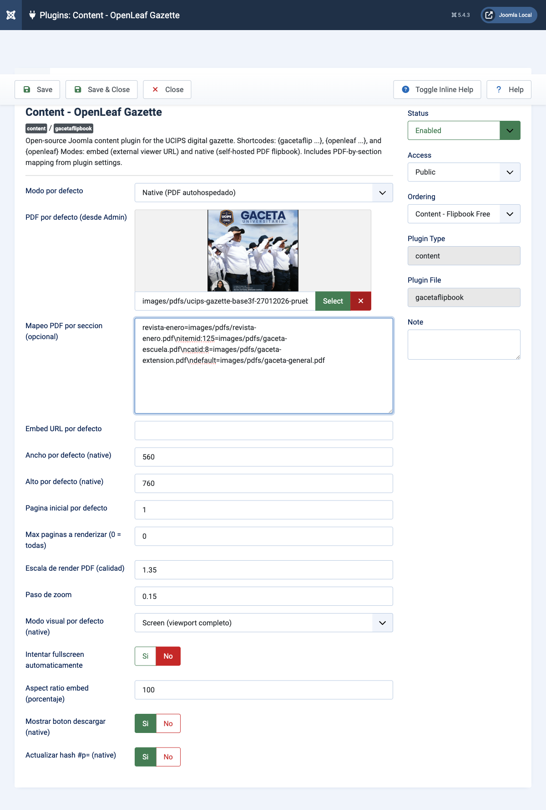

# OpenLeaf Gazette

Open-source Joomla 5 content plugin for the UCIPS digital gazette.

## Features

- `embed` mode: uses external flipbook URLs (closest match to FlipHTML5 style).
- `native` mode: self-hosted PDF flipbook rendering with `pdf.js + StPageFlip`.
- Admin-first workflow: choose a default PDF in plugin settings and render with `{openleaf}`.
- Multiple PDFs from plugin settings with section-aware mapping (`section`, `Itemid`, or `catid`).
- Shortcodes supported:
  - `{gacetaflip ...}`
  - `{gacetaflipbook ...}`
  - `{openleaf ...}`
  - `{openleaf}`

## Installation

1. Joomla Administrator -> `System -> Install -> Extensions`.
2. Upload the plugin zip.
3. Enable `Content - OpenLeaf Gazette`.

## CI/CD ZIP publishing

- GitHub Actions workflow: `.github/workflows/cicd.yml`
- On every push/PR, CI builds the Joomla installable ZIP and uploads it as an artifact.
- On tags like `v1.1.0`, CD also uploads the ZIP file to the GitHub Release.
- Local build command:

```bash
./scripts/build-zip.sh
```

## Release and distribution

Use this flow for production distribution:

1. Update plugin version in `gacetaflipbook.xml`.
2. Build local package:

```bash
./scripts/build-zip.sh
```

3. Commit and push to `main`.
4. Create and push release tag:

```bash
git tag vX.Y.Z
git push origin vX.Y.Z
```

5. Verify in GitHub Actions:
- `Build Joomla Plugin ZIP` job passed.
- Release exists with `dist/*.zip` attached.

Detailed Spanish guide:
- `docs/RELEASE_ES.md`

## Usage

### Option A: Joomla Admin (recommended)

1. Go to `System -> Manage -> Plugins`.
2. Open `Content - OpenLeaf Gazette`.
3. Set:
   - `Modo por defecto = Native`
   - `PDF por defecto (desde Admin) =` your file from Media Manager
   - `Mapeo PDF por seccion (opcional) =` one mapping per line
   - `Modo visual por defecto (native) = Screen`
   - `Intentar fullscreen automaticamente = No`
   - `Mostrar boton descargar (native) = No`
4. Save.
5. In your article, module, or component text use:

```text
{openleaf}
```

### Option B: multiple PDFs from plugin settings (no hardcoded file per article)

Configure `Mapeo PDF por seccion (opcional)` in plugin settings.

Accepted line formats:

```text
key=value
key|value
```

Examples:

```text
# Custom keys used by shortcode
revista-enero=images/pdfs/revista-enero.pdf
revista-febrero=images/pdfs/revista-febrero.pdf

# Automatic by menu item
itemid:125=images/pdfs/gaceta-escuela.pdf
menu:140=images/pdfs/gaceta-investigacion.pdf

# Automatic by article category
catid:8=images/pdfs/gaceta-extension.pdf
category:12=images/pdfs/gaceta-postgrado.pdf

# Global fallback from map
default=images/pdfs/gaceta-general.pdf
```

Then in content:

```text
{openleaf section="revista-enero"}
```

Or simply:

```text
{openleaf}
```

with automatic resolution by current `Itemid`/`catid` when a matching map entry exists.

Resolution precedence in native mode:
1. `file` / `pdf` in shortcode
2. `section` / `key` in shortcode (map lookup)
3. `itemid:ID` or `menu:ID` in map
4. `catid:ID` or `category:ID` in map
5. `context:com_xxx...`, then `default` / `*` in map
6. `PDF por defecto (desde Admin)`

### Option C: shortcode with explicit params

Embed mode:

```text
{openleaf mode="embed" url="https://online.fliphtml5.com/HmoralesZ/HCJ-gaceta-piloto-01/#p=26"}
```

Native mode:

```text
{openleaf mode="native" file="images/pdfs/ucips-gazette-base3f-27012026-prueba.pdf" start="1" maxpages="0" fit="screen" autofullscreen="0" download="1"}
```

### Template/module/component integration

- Article (`com_content`): place `{openleaf}` in the article body.
- Custom module in template position:
  - Create a `Custom` module.
  - Put `{openleaf}` in module content.
  - Enable module option `Prepare Content = Yes`.
- Custom component:
  - Trigger the content plugin event (`onContentPrepare`) on your text field before rendering.
  - Output the transformed text so `{openleaf}` is replaced by the viewer HTML.

## Admin screenshots






## License

MIT
